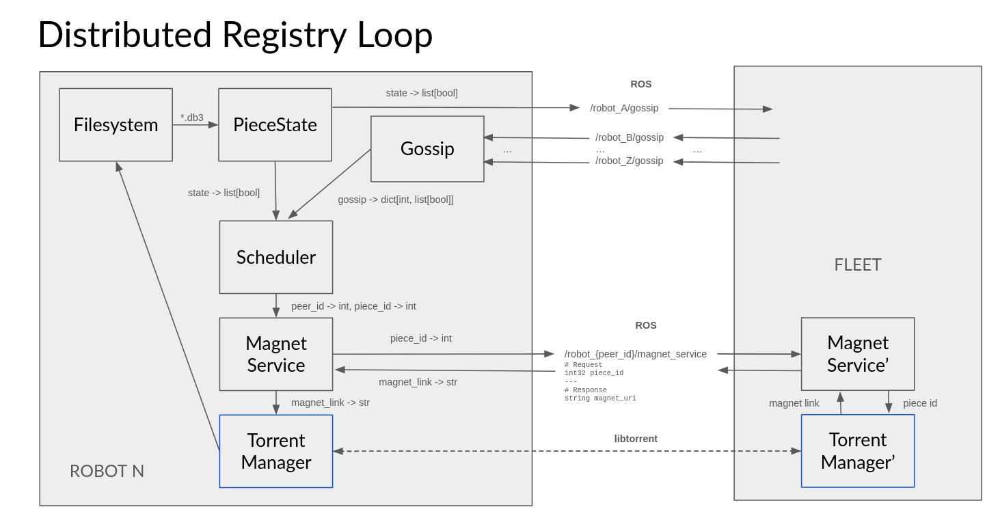

```markdown
# torrent_ws

`torrent_ws` provides tooling and ROS 2 nodes for **submap-level pose graph sharing** across a multi-robot fleet using a BitTorrent-style distribution model.

---

## Relevant Scripts

### `scripts/deconstruct_posegraph.py`
Reads a pose graph from `$VTRTEMP`, splits it into **submap-level pieces**, and stores them under:

```

deconstructed/<robot_id>/<posegraph_name>/

```

Example:
```

deconstructed/0/woody_convoy/

```

Here, `0` denotes the robot ID that originally generated the pose graph.

---

### `scripts/reconstruct_posegraph.py`
Reads submap pieces from:

```

deconstructed/<robot_id>/<posegraph_name>/

```

Reassembles them into a valid pose graph and writes the result to:

```

reconstructed/<robot_id>/<posegraph_name>/

```

---

## `src/torrent_pkg`

### `registry_node.py`

The **RegistryNode** is a ROS 2 node that runs on every robot in the fleet. It coordinates discovery, scheduling, and transfer of submap pieces using gossip and BitTorrent.

Each RegistryNode performs the following responsibilities:

1. **Broadcast local piece possession** via a gossip topic  
2. **Receive gossip** from other robots and maintain a local registry  
3. **Decide which piece to request next**, and from which peer  
4. **Request or serve magnet links** via ROS services  
5. **Initiate and manage BitTorrent downloads** using libtorrent  

---

## Internal Architecture

The `RegistryNode` is composed of several modular components:

### 1. `PieceState`
- Sole authority on **local piece possession**
- The only component allowed to read from the filesystem
- Scans available submap pieces at startup
- Provides thread-safe access to:
  - missing pieces
  - owned pieces
  - bitfield representation for gossip

Used by:
- Gossip publishing
- Scheduler decision-making

---

### 2. `GossipInterface`
- Maintains a local registry of **which peers claim to have which pieces**
- Updated via incoming gossip messages
- Exposes:
  - known peers
  - per-piece availability across the fleet

---

### 3. `Scheduler`
- Compares:
  - local state (`PieceState`)
  - global knowledge (`GossipInterface`)
- Determines the **next piece to request**
- Tracks in-flight downloads to avoid duplicate requests

Current policy (as of 21-01):
> Request the lowest-indexed missing piece that at least one peer advertises.

---

### 4. `MagnetService`
- Acts as an intermediary between the Scheduler and the Torrent layer
- Implements `torrent_msgs/msg/GetMagnetURI`
- Responsibilities:
  - Request a magnet link from a peer for `(peer_id, piece_id)`
  - Serve magnet links to requesting peers

---

### 5. `TorrentManager`
- Wraps **libtorrent** functionality
- Runs in its own thread
- Responsible for:
  - seeding local pieces
  - downloading remote pieces once a magnet URI is available
  - tracking torrent progress and completion

---

## System Diagram



This diagram illustrates the data flow between:
- gossip dissemination
- scheduling decisions
- magnet exchange
- torrent-based piece transfer
```
